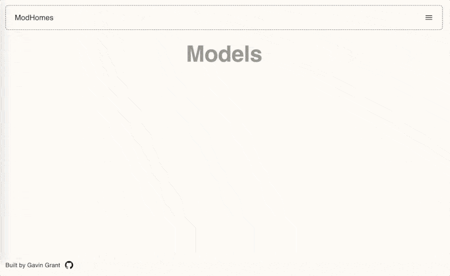

# ModHomes

This app leverages React Three Fiber to render 3d models of modular homes.

## Live App

See a live version of this app here: [modhomes.vercel.app](https://modhomes.vercel.app/).

## Technology

* TypeScript - strongly typed programming language
* ReactJS - user interface library
* NextJS - React framework for production
* Material UI - React components
* React Three Fiber - React renderer for three.js
* Vercel - platform for deploying and hosting

## Setup

* Clone this repository to your local computer.
* Install the dependencies for the project: `yarn install`
* Run the application locally: `yarn dev`
* Open `http://localhost:3000/` in your browser.